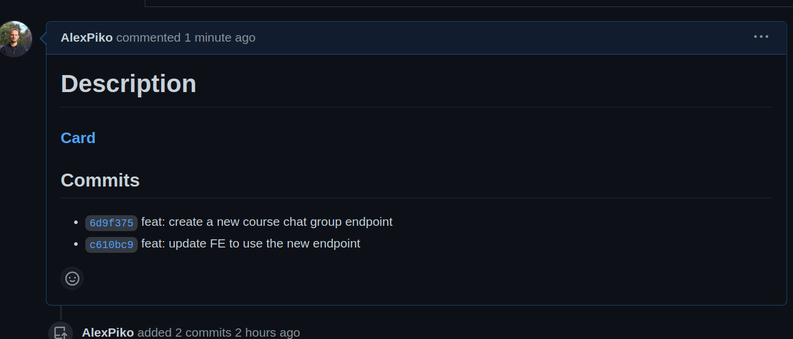

# git-pr

Prepares a merge request description, with link to Shortcut card and current branch commit list.

**Table des contents** 
1. [Commands](#commands)
   - [Description](#description)  
   - [Status](#status)  
   - [Open](#open)  	
3. [Installation](#installation)


## Commands

```
git mr -d|description
git mr -s|status
git mr -o|open
```
### Description
`git mr -d|description`

Get a PR description that you can copy/past and complete when you create the PR.



### Status
`git mr -s|status`

Get you PR status: PR's link, reviwers review status.

### Open 
`git mr -o|open`

Open your GitHub PR in your browser

## Installation
### Command installation
Dependencies
`bash`, `git` and usual command-line utilities: `grep`, `sed`, `curl`, `head`, `tail`, `tr`.
https://stedolan.github.io/jq/ is required and needs to be in PATH.

### git-pr
Add the git-pr directory to your PATH
in one of your shell startup scripts:
```
PATH="${PATH}:/path/to/git-pr"
```
OR

Define it as a Git alias:
run:
```
git config --global alias.pr '!bash /path/to/git-mr/git-pr'
```
or edit your ~/.gitconfig directly:
```
[alias]
	pr = "!bash /path/to/git-pr/git-pr.sh"
```

### Shorcut configuration 
To get a Shortcut API Token: https://developer.shortcut.com/api/rest/v3#Authentication
Set this token in your git config:
```
git config --global pr.shortcut-token "abcdefghijklmnopqrstuvwx"
```
